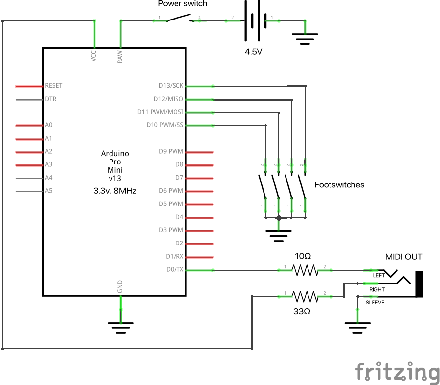

# MIDI footswitch for Headrush MX5

This repository contains code for programming an Arduino as a MIDI controller for controlling the looper on the [Headrush MX5](https://www.headrushfx.com/products/mx5) guitar multi-effects unit. 

The code could be adapted for controlling other functions on the MX5, or indeed for controlling any other MIDI-enabled device.

## Why did I do this?

The on-board looper on the MX5 is very good in many respects: for example, the looper can record loops of virtually any length, whereas many other units limit their loopers to a minute or less.

However, the MX5's looper (in my opinion) suffers from an annoying flaw: the looper only engages when the in-built footswitch is *released*, not when it is *pressed*. This means that, unless you are very quick in pressing and releasing, or unless you press the switch momentarily "before the beat", it is very easy to miss the first beat of the loop.

Hence I wanted to create a footswitch that triggers the looper as soon as it is pressed. (Also, it's handy to have a separate footswitch for the looper, so that the in-built switches can be used for patch or effect switching.)

## The circuit

The circuit is pretty simple:
 * It is based around an [**Arduino Pro Mini 3.3V** (8MHz)](https://docs.arduino.cc/retired/boards/arduino-pro-mini). This is the lower-voltage version of the Pro Mini and contains only a minimal set of on-board equipment, which is useful for conserving power.
 * **Power** comes from a set of 3x1.5V batteries, wired between GND and RAW, via a toggle switch.
 * The **footswitches** are momentary (non-latching) push-to-make switches, connected between GND and the input/output pins. (I don't think it matters much which of these pins you pick, as long as they match the pins you use in the code, of course. The schematic below shows the use of 4 arbitrary pins, but you can pick others.)
 * The **MIDI signal** is sent out through a 3.5mm TRS jack socket. The MX5's MIDI ports are also jack sockets (not DIN connectors), so the footswitch can be connected to the MX5 simply through a standard aux cable. Since we are working at 3.3V, we use 10 and 33 ohm resistors. See the schematic below for more details.

 ## The code

The code is in this repository. It uses the Arduino MIDI library by Francois Best (v5.0.2). The MX5 responds to MIDI Control Change (CC) messages. The ones used here are:

| CC code | Meaning                  |
| :------ | :-----                   |
| 69      | Looper start/stop        |
| 70      | Record / overdub         |
| 72      | Peel (remove last layer) |
| 73      | Mute                     |
  
but you could edit the code to emit other messages. See the [MX5 manual](https://cdn.inmusicbrands.com/HeadRush/mx5/MX5_User_Guide_v1.2.pdf) for the full set.

Note that when a switch is pressed:
 1. we check to make sure the same switch hasn't been pressed very recently, to avoid unwanted "double presses" (de-bouncing)
 2. we send a "high" CC message, *immediately* followed by a "low" CC message, as the MX5 seems to respond to the "low" message. We don't wait for the footswitch to be released before sending the "low" message.

## The hardware

The footswitch itself consists of four individual switches enclosed in a JP1590BB aluminium enclosure (Approx 119.5 x 94 mm x 34 mm), purchased from [Jed's Peds](https://www.jedspeds.co.uk/product-page/jp150bb-enclosure). A toggle switch connects and disconnects the battery from the Arduino, and a 3.5mm jack acts as the MIDI out port.

## How to ask me a question about this

If you have any questions, please open a Discussion topic in this repository.

## Notes for the future

If I ever get around to making a version 2, I would do the following:
 * Add a status LED showing whether the unit is recording, overdubbing, playing or stopped. As the MX5 does not communicate its state, this would have to be inferred from the footswitches that have been pressed.
 * Remove the on-board LED from the Arduino, as this just drains power.
